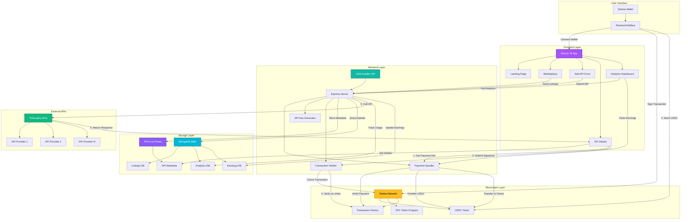

# FluxAPI - AI-Powered API Marketplace

A modern, blockchain-powered marketplace for AI APIs with Solana payment integration. Monetize your APIs instantly and discover powerful AI tools.


## 🌟 Features

- **🚀 API Marketplace** - Browse, list, and discover AI-powered APIs
- **💰 Blockchain Payments** - Solana-based USDC payments for API usage
- **🔐 Secure Verification** - Manual Solana transaction verification
- **📊 Analytics Dashboard** - Track API usage and earnings in real-time
- **🎨 Modern UI** - Beautiful dark theme with glassmorphism effects
- **📱 Responsive Design** - Works seamlessly on all devices
- **🔗 IPFS Integration** - Decentralized storage for API metadata
- **💳 Wallet Integration** - Phantom & Solana wallet support

## �️ Architecture Diagram



## �🏗️ Project Structure

```
FluxAPI/
├── frontend/              # Next.js 15 frontend application
│   ├── app/              # App router pages
│   │   ├── page.tsx      # Landing page
│   │   ├── marketplace/  # API marketplace listing
│   │   ├── add-api/      # API submission form
│   │   ├── analytics/    # Usage analytics dashboard
│   │   └── api/          # Dynamic API detail pages
│   ├── components/       # Reusable UI components (shadcn/ui)
│   └── lib/             # Utility functions
│
├── x402-handler/         # Backend API & payment handler
    ├── index.js         # Express server with Solana integration
    └── lib/             # IPFS, MongoDB, and keygen utilities

```

## 🚀 Quick Start

### Prerequisites

- **Node.js** 18+ 
- **MongoDB Atlas** account (for API listings storage)
- **Pinata** account (for IPFS storage)
- **Solana Wallet** (Phantom recommended)
- **USDC** on Solana devnet/mainnet for testing

### 1. Clone the Repository

```bash
git clone https://github.com/kpj2006/FluxAPI.git
cd FluxAPI
```

### 2. Setup Backend (x402-handler)

```bash
cd x402-handler
npm install

# Create .env file
cp .env.example .env
```

Configure your `.env`:

```env
PORT=4021
MONGODB_URI=mongodb+srv://your-mongodb-uri
PINATA_API_KEY=your-pinata-api-key
PINATA_SECRET_KEY=your-pinata-secret-key
SOLANA_RPC_URL=https://api.devnet.solana.com
SOLANA_PRIVATE_KEY=your-base58-encoded-private-key
USDC_MINT=Gh9ZwEmdLJ8DscKNTkTqPbNwLNNBjuSzaG9Vp2KGtKJr
```

Start the backend:

```bash
npm start
# or for development with auto-reload
npm run dev
```

Backend runs on `http://localhost:4021`

### 3. Setup Frontend

```bash
cd ../frontend
npm install

# Create .env.local file
```

Configure `.env.local`:

```env
NEXT_PUBLIC_API_URL=http://localhost:4021
```

Start the frontend:

```bash
npm run dev
```

Frontend runs on `http://localhost:3000`

## 📖 Usage Guide

### For API Providers

#### 1. **List Your API**
   - Connect your Solana wallet
   - Click "Add API" or "List Your API"
   - Fill in API details:
     - Name, description, category
     - Endpoint URL
     - Cost per request
     - Documentation link
     - Tags

#### 2. **Generate Access Code**
   - Click "Generate Access Code"
   - Copy the generated API key
   - Integrate into your API for verification

#### 3. **Set Receiving Address**
   - Enter your Solana wallet address
   - This is where you'll receive USDC payments

#### 4. **Submit & Earn**
   - Review your listing
   - Submit to marketplace
   - Start earning from API usage!

### For API Consumers

#### 1. **Browse Marketplace**
   - Visit `/marketplace`
   - Search and filter APIs by category/tags
   - View API details and documentation

#### 2. **View API Details**
   - Click "View Details" on any API
   - See pricing, features, and integration guides
   - Check API status and uptime

#### 3. **Make API Calls**
   - Get payment info from `/aipi/payment-info?id=<CID>`
   - Send USDC payment to specified address
   - Submit transaction signature to `/aipi/`
   - Receive API response

#### 4. **Track Usage**
   - Click "Stats" button
   - View usage analytics
   - Monitor spending and API performance

## 🔌 API Endpoints

### Backend (x402-handler)

#### Payment Flow

**Get Payment Info**
```http
GET /aipi/payment-info?id=<IPFS_CID>
```

**Make Paid API Call**
```http
POST /aipi/
Content-Type: application/json

{
  "cid": "<IPFS_CID>",
  "signature": "<solana_transaction_signature>",
  "requestId": "<uuid>",
  "data": {}
}
```

#### Management Endpoints

**Get All Listings**
```http
GET /listings
```

**Store New Listing**
```http
POST /store-listing
{
  "cid": "QmXxx...",
  "ownerId": "SolanaPublicKey...",
  "earning": 0
}
```

**Generate API Key**
```http
POST /keygen
{
  "cid": "QmXxx..."
}
```

**Get Usage Statistics**
```http
GET /usage/:apiId
```

**Claim Earnings**
```http
POST /claim
{
  "apiId": "QmXxx..."
}
```

**Check Balance**
```http
GET /balance/:address
```

**Health Check**
```http
GET /health
```


## 🔒 Security Features

- ✅ On-chain transaction verification
- ✅ Payment signature validation
- ✅ CORS protection
- ✅ Environment variable encryption
- ✅ MongoDB authentication
- ✅ Rate limiting (recommended to add)
- ✅ Input validation and sanitization

## 🧪 Testing

### Test Payment Flow

1. **Get Devnet USDC**
   ```bash
   solana airdrop 1
   spl-token create-account Gh9ZwEmdLJ8DscKNTkTqPbNwLNNBjuSzaG9Vp2KGtKJr
   ```

2. **Test API Listing**
   - Add a test API through the UI
   - Verify it appears in marketplace
   - Check IPFS storage

3. **Test Payment**
   - Get payment info from backend
   - Make USDC transfer
   - Submit transaction signature
   - Verify API response

4. **Test Claims**
   - Accumulate test earnings
   - Claim earnings through UI
   - Check Solana Explorer for transaction

## 📊 Technology Stack

### Frontend
- **Next.js 15.2.4** - React framework with App Router
- **TypeScript** - Type-safe development
- **Tailwind CSS** - Utility-first styling
- **shadcn/ui** - Beautiful component library
- **@solana/wallet-adapter** - Wallet integration
- **Lucide Icons** - Modern icon set

### Backend
- **Node.js** - JavaScript runtime
- **Express** - Web server framework
- **@solana/web3.js** - Solana blockchain integration
- **MongoDB** - Database for listings
- **IPFS (Pinata)** - Decentralized storage
- **dotenv** - Environment configuration

### Blockchain
- **Solana** - High-speed, low-cost blockchain
- **USDC** - Stablecoin for payments
- **SPL Tokens** - Token standard for transfers

## 🐛 Troubleshooting

### Frontend Issues

**Port already in use**
```bash
# Kill process on port 3000
npx kill-port 3000
npm run dev
```

**Wallet not connecting**
- Make sure Phantom wallet is installed
- Check if you're on the correct network (devnet/mainnet)
- Clear browser cache and reload

### Backend Issues

**MongoDB connection failed**
- Verify MongoDB URI in `.env`
- Check network access in MongoDB Atlas
- Whitelist your IP address

**IPFS upload failed**
- Verify Pinata API keys
- Check file size limits
- Ensure internet connectivity

**Transaction verification failed**
- Transaction may not be confirmed yet (wait 5-10 seconds)
- Check if you're on correct network
- Verify USDC token account exists
- Amount/recipient mismatch


## 📄 License

This project is licensed under the ISC License.


**⚡ Built with ❤️ using Solana & Next.js**
